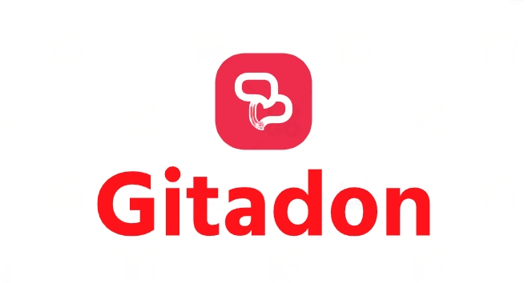

# Gitadon



## Overview

This is a Python bot that monitors your GitHub repositories for new commits and posts updates to Mastodon. The bot periodically checks for new commits in your repositories and, if a new commit is detected, it sends a post to your Mastodon account with a link to the commit on GitHub.

## How It Works

The bot uses the GitHub API to fetch the latest commit SHA for each repository and compares it with the last known commit SHA. If a new commit is found, it generates a post with the commit URL and sends it to your Mastodon account using the Mastodon API.

## Installation

1. Make sure you have Python installed on your system. If not, download and install Python from the official website: [https://www.python.org/downloads/](https://www.python.org/downloads/)

2. Clone this repository to your local machine:

```bash
git clone https://github.com/your-github-username/github-to-mastodon-bot.git
cd github-to-mastodon-bot
```

 3. Install the required libraries using pip:
```bash
pip install requests
pip install Mastodon.py
```
4. Configure the bot:

Open github_to_mastodon_bot.py in a text editor.

Replace the placeholders with your actual <b>GitHub username and access token</b>, as well as your <b>Mastodon instance URL and access token</b>.

## Run the bot:

```bash
python github_to_mastodon_bot.py
``````
The bot will now start monitoring your GitHub repositories and posting updates to Mastodon when new commits are detected.


<br>
<br>

# How to Get GitHub Access Token

<h3> <center> To use this bot, you need a GitHub Personal Access Token to authenticate API requests. Follow these steps to get your access token: </center> </h3>
<br>

1) Log in to your GitHub account.

2) Go to your GitHub settings by clicking on your profile picture in the top right corner and selecting "Settings."

3) In the left sidebar, click on "Developer settings."

4) From the "Developer settings" menu, click on "Personal access tokens."

5) Click the "Generate new token" button.

6) Give your token a name, select the desired scopes (usually "repo" is enough for this bot), and click "Generate token."

7) Copy the generated token and use it as your GITHUB_ACCESS_TOKEN in the bot's configuration.

<br>

<center> <h2> How to Get Mastodon Access Token: </h2></center>

<center><h3>To post updates to Mastodon, you need an access token for your Mastodon account. Here's how you can obtain it:</h3></center>


<h4> 

1. Log in to your Mastodon account on your instance. 


2. Go to "Preferences" > "Development" > "Your applications" (or something similar depending on your instance).

3. Click on "New application" or "Create an application."

4. Fill in the required fields. For the redirect URI, you can use any valid URI (e.g., "https://example.com").

5. Click "Submit" or "Create application."

6. The access token will be generated. Copy the access token and use it as your MASTODON_ACCESS_TOKEN in the bot's configuration.

